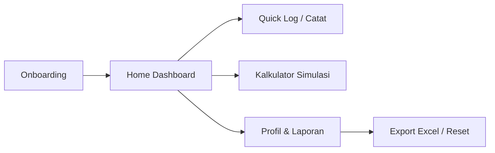

# Mode Hemat

> "Biar uang nggak cuma lewat azza."

Web app pencatat keuangan pribadi bertema modern dan minimalis untuk memantau pengeluaran harian serta kontrol budget bulanan secara instan tanpa ribet.

# Alur Kerja (Workflow)

### 1. Onboarding (Setup Awal)
* Pengguna memasukkan:
  * **Nama panggilan**
  * **Uang yang dipegang saat ini** (saldo awal)
  * **Budget pengeluaran bulan ini**
* Data otomatis tersimpan di browser via `localStorage` (tanpa perlu register/login).

### 2. Dashboard (Home)
* **Status Saldo & Budget**: Pantau saldo saat ini (bisa disembunyikan/diintip dengan tombol mata) dan sisa budget bulanan lengkap dengan progress bar indikator.
* **Quick Log (1-Klik)**: Tombol instan untuk mencatat pengeluaran rutin (Makan, Kopi, Bensin, Snack) tanpa harus mengetik manual. Item Quick Log dapat ditambah/diedit.
* **Pengeluaran Harian & Insight**: Filter riwayat per tanggal melalui kalender dengan feedback status pengeluaran harian (Aman / Overbudget).
* **Toast & Undo**: Setiap transaksi yang baru saja dicatat bisa langsung dibatalkan (*Undo*) via notifikasi toast.

### 3. Catat Pengeluaran Manual
* Formulir input cepat:
  1. Masukkan **Nominal** (auto-format Rupiah)
  2. Isi **Nama pengeluaran**
  3. Pilih **Kategori** (*Makan, Jajan, Transport, Belanja, Lainnya*)
  4. Tambah **Catatan** (opsional)
* Saldo uang dan budget bulanan otomatis terpotong seketika.

### 4. Kalkulator Simulasi
* Cek sisa uang sebelum jajan atau belanja.
* Mendukung 2 mode perbandingan:
  * **Sisa Uang**: Uang kas - nominal belanja
  * **Sisa Budget**: Budget bulanan tersisa - nominal belanja

### 5. Profil, Riwayat & Export
* **Statistik Keuangan**: Total pengeluaran bulan berjalan, rata-rata harian, jumlah transaksi, dan sisa budget.
* **Riwayat Transaksi**: Dikelompokkan rapi per tanggal (bisa di-*collapse* / di-*expand*) dan dilengkapi kotak pencarian (*live search*).
* **Export Excel**: Unduh seluruh riwayat transaksi ke file format Excel (`.xls`).
* **Fitur Pendukung**: Dark Mode / Light Mode toggle serta opsi Reset Data untuk mulai dari nol.

# Tech Stack

* **Frontend**: HTML5, CSS3 (Modern Flexbox/Grid, CSS Variables, Glassmorphism)
* **Scripting**: Vanilla JavaScript (ES6+)
* **Penyimpanan**: Browser `localStorage` (Offline-first, data tetap aman di perangkat lokal)
* **Icon & Font**: [Phosphor Icons](https://phosphoricons.com/) & [Plus Jakarta Sans](https://fonts.google.com/specimen/Plus+Jakarta+Sans)
* **Animasi**: [GSAP](https://greensock.com/gsap/)

# Cara Menjalankan

Tidak butuh instalasi dependency atau server backend:
1. Buka folder proyek.
2. Klik ganda file `index.html` pada browser apa pun (Chrome, Edge, Firefox, Safari), atau jalankan via *Live Server*.
